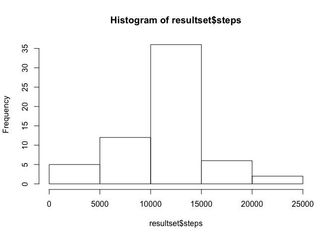

# Reproducible Research: Peer Assessment 1

## Loading and preprocessing the data
The data relevant for this submission is in a standard csv file.

```r
data <- read.csv("activity.csv")
```
The column names in  the data set are: steps, date, interval.

## What is mean total number of steps taken per day?

```r
library(dplyr)
```

```
## 
## Attaching package: 'dplyr'
## 
## The following object is masked from 'package:stats':
## 
##     filter
## 
## The following objects are masked from 'package:base':
## 
##     intersect, setdiff, setequal, union
```

```r
totalperday <- group_by(data,date)
totalperday <- summarize(totalperday,steps=sum(steps))
hist(totalperday$steps)
```

 

```r
totalmean  <- mean(totalperday$steps, na.rm=TRUE)
totalmedian <- median(totalperday$steps, na.rm=TRUE)
print(totalmean)
```

```
## [1] 10766.19
```

```r
print(totalmedian)
```

```
## [1] 10765
```

## What is the average daily activity pattern?

```r
library(dplyr)
dailypattern <- group_by(data,interval)
dailypattern <- summarize(dailypattern,steps=mean(steps,na.rm=TRUE))
max <- max(dailypattern$steps)
limit <- max+max(dailypattern$steps)/10
plot(dailypattern$interval/100,dailypattern$steps,type="l",ylim=c(0,limit))
```

 

The average maximum number of steps done in a 5 minute intervall is 206.17.

The average maximum number of steps are done between 8:30 and 8:35 

## Imputing missing values
First lets count the number of NA available in the data set.

```r
nadata <- is.na(data$steps)
sum(nadata)
```

```
## [1] 2304
```
The number of NAs availbale in the dataset are 2304.

The proposed strategy in the Assessment is to fill in mean/median in the NAs.
I'll replace the NA with the mean of the corrisponding 5-minute intervall.

```r
grouped <- group_by(data,date)
meanperday <- summarize(grouped,meanperday=mean(steps,na.rm=TRUE))
temp <- data
for(i in meanperday$date){
       for(j in temp[temp$date==i,3]){
               temp[temp$date==i & temp$interval==j,1] <- meanperday[meanperday$date==i,1]
       }
}
```
Here the histogramm of total number of steps per day for the data without NA's:

```r
resultset <- group_by(temp,date)
resultset <- summarize(resultset,steps=sum(steps))
hist(resultset$steps)
```

 

The mean of steps per day now is 8928 and the median of steps per day now is 8928


## Are there differences in activity patterns between weekdays and weekends?
