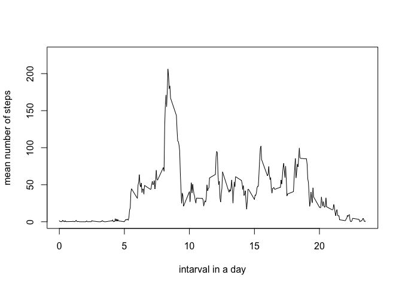
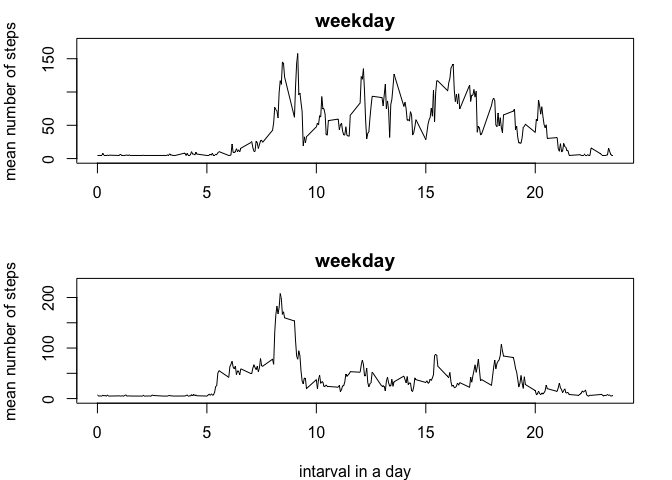

# Reproducible Research: Peer Assessment 1

## Loading and preprocessing the data
The data relevant for this submission is in a standard csv file.

```r
data <- read.csv("activity.csv")
```
The column names in  the data set are: steps, date, interval.
The dimensions of the dataset are..

* number of columns = 3 
* number of rows = 17568

## What is mean total number of steps taken per day?

```r
library(dplyr)
```

```
## 
## Attaching package: 'dplyr'
## 
## The following object is masked from 'package:stats':
## 
##     filter
## 
## The following objects are masked from 'package:base':
## 
##     intersect, setdiff, setequal, union
```

```r
totalperday <- group_by(data,date)
totalperday <- summarize(totalperday,steps=sum(steps))
hist(totalperday$steps)
```

 

```r
totalmean  <- mean(totalperday$steps, na.rm=TRUE)
totalmedian <- median(totalperday$steps, na.rm=TRUE)
print(totalmean)
```

```
## [1] 10766.19
```

```r
print(totalmedian)
```

```
## [1] 10765
```

## What is the average daily activity pattern?

```r
library(dplyr)
dailypattern <- group_by(data,interval)
dailypattern <- summarize(dailypattern,steps=mean(steps,na.rm=TRUE))
max <- max(dailypattern$steps)
limit <- max+max(dailypattern$steps)/10
plot(dailypattern$interval/100,dailypattern$steps,type="l",ylim=c(0,limit),ylab="mean number of steps",xlab="intarval in a day")
```

 

The average maximum number of steps done in a 5 minute intervall is 206.17.

The average maximum number of steps are done between 8:30 and 8:35 

## Imputing missing values
First lets count the number of NA available in the data set.

```r
nadata <- is.na(data$steps)
sum(nadata)
```

```
## [1] 2304
```
The number of NAs availbale in the dataset are 2304.

The proposed strategy in the Assessment is to fill in mean/median in the NAs.
I'll replace the NA with the mean.

```r
grouped <- group_by(data,date)
grouped <- summarize(grouped,steps=mean(steps,na.rm=TRUE))
mymean <- mean(grouped$steps,na.rm=TRUE)
for(i in 1:length(data[,3])){
        if (is.na(data[i,1])){
                data[i,1] <- mymean
        }
}
```

Here the histogramm of total number of steps per day for the data without NA's:

```r
resultset <- group_by(data,date)
resultset <- summarize(resultset,steps=sum(steps))
hist(resultset$steps)
```

 


## Are there differences in activity patterns between weekdays and weekends?

```r
for(i in 1:length(data$date)){
       if(weekdays(as.Date(data[i,2])) %in% c("Montag","Dienstag","Mittwoch","Donnerstag","Freitag")){
               data[i,4] <- c("weekday")
       }
       else if(weekdays(as.Date(data[i,2])) %in% c("Samstag","Sonntag")){
               data[i,4] <- c("weekend")
       }
}
par(mfrow=c(2,1),mar=c(4,4,2,2))
temp <- data[data$V4=="weekend",]
dailypattern <- group_by(temp,interval)
dailypattern <- summarize(dailypattern,steps=mean(steps,na.rm=TRUE))
max <- max(dailypattern$steps)
limit <- max+max(dailypattern$steps)/10
plot(dailypattern$interval/100,dailypattern$steps,type="l",ylim=c(0,limit),ylab="mean number of steps",xlab="",main="weekday")
temp <- data[data$V4=="weekday",]
dailypattern <- group_by(temp,interval)
dailypattern <- summarize(dailypattern,steps=mean(steps,na.rm=TRUE))
max <- max(dailypattern$steps)
limit <- max+max(dailypattern$steps)/10
plot(dailypattern$interval/100,dailypattern$steps,type="l",ylim=c(0,limit),ylab="mean number of steps",xlab="intarval in a day",main="weekday")
```

 
